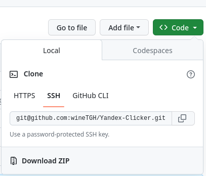
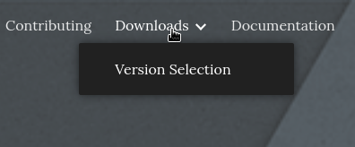
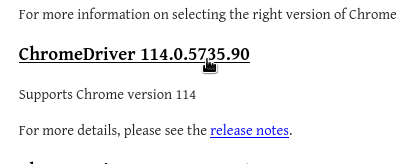
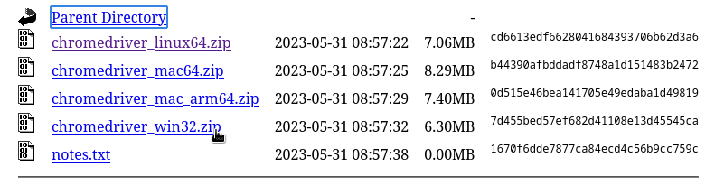
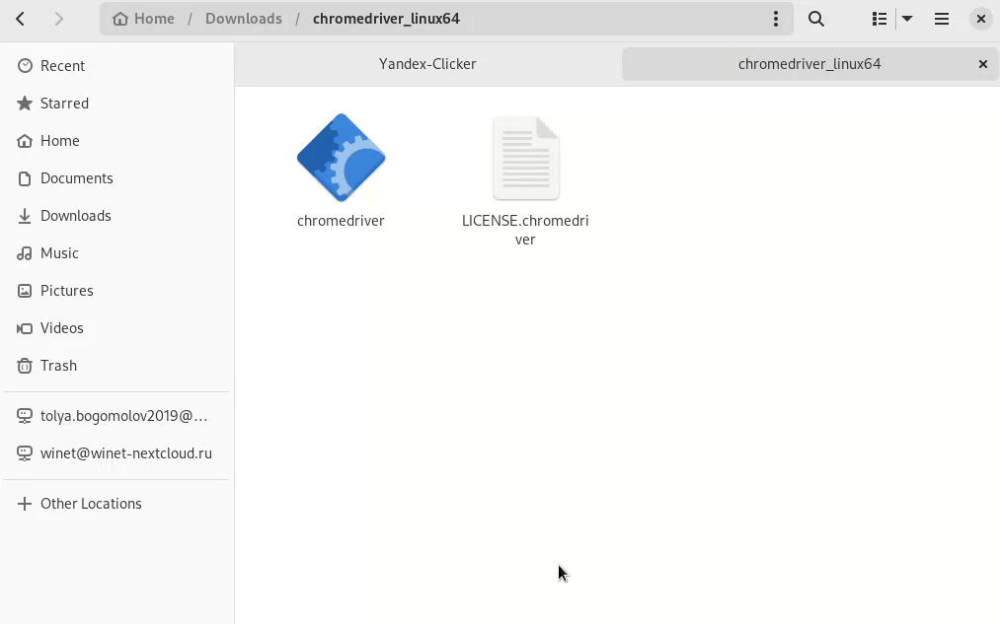

# Yandex-Clicker

## Инструкция по установке

1. Скачайте исходный код

2. Скачайте chromedriver для своей ОС и версии Chrome

3. Распакуйте и перенесите драйвер в папку yandexClicker/Drivers

4. Переименуйте драйвер в `chromedriver` (без `.exe`)
5. Откройте терминал в корне проекта (shift + ПКМ -> открыть в powershell).
6. Введите следующие команды:
    + `python -m venv venv`
    + `pip install -r requirements.txt`
    + `./venv/scripts/activate.ps1` ([Если вышла ошибка](https://stackoverflow.com/questions/18713086/virtualenv-wont-activate-on-windows))
7. Настройте парсер (см. [Настройка](#настройка))
8. Запустите парсер с помощью команды `python run.py`

## Настройка

Конфиг находится по пути `yandexClicker/config.py`

### Описание пунктов

+ `DEBUG=True` - Принимает `True` или `False`. Включает показ окна браузера
+ `mobile=True` - Принимает `True` или `False`. Переключатель между десктопной и мобильной версией сайта
+ `search_term = "Купить ноутбук"` - Принимает строку. Поисковый запрос
+ `link_masks = [r".",]` - Принимает массив "сырых" строк. Массив масок для ссылок. Если ссылка совпадает с маской, парсер будет её учитывать в процессе. По умолчанию маска пропускает любые ссылки. [Больше про маски](https://habr.com/ru/articles/349860/).
+ `index=1` - Принимает целое число от 0 до бесконечности. Порядковый номер ссылки в выдачи, на которую надо кликнуть. Если свойство отсутствует (или закомментировано `#`-ой) будет выбрана первая ссылка в выдаче.
+ `delay_interval = [1, 2]` - Принимает массив из двух целых чисел. Интервал (в секундах) перед закрытием страницы. Выбирается случайное число в диапазоне.
+ `region = "Москва"` - Принимает строку. Указывает регион поиска. Если свойство отсутствует (или закомментировано `#`-ой) выбор региона пропускается.